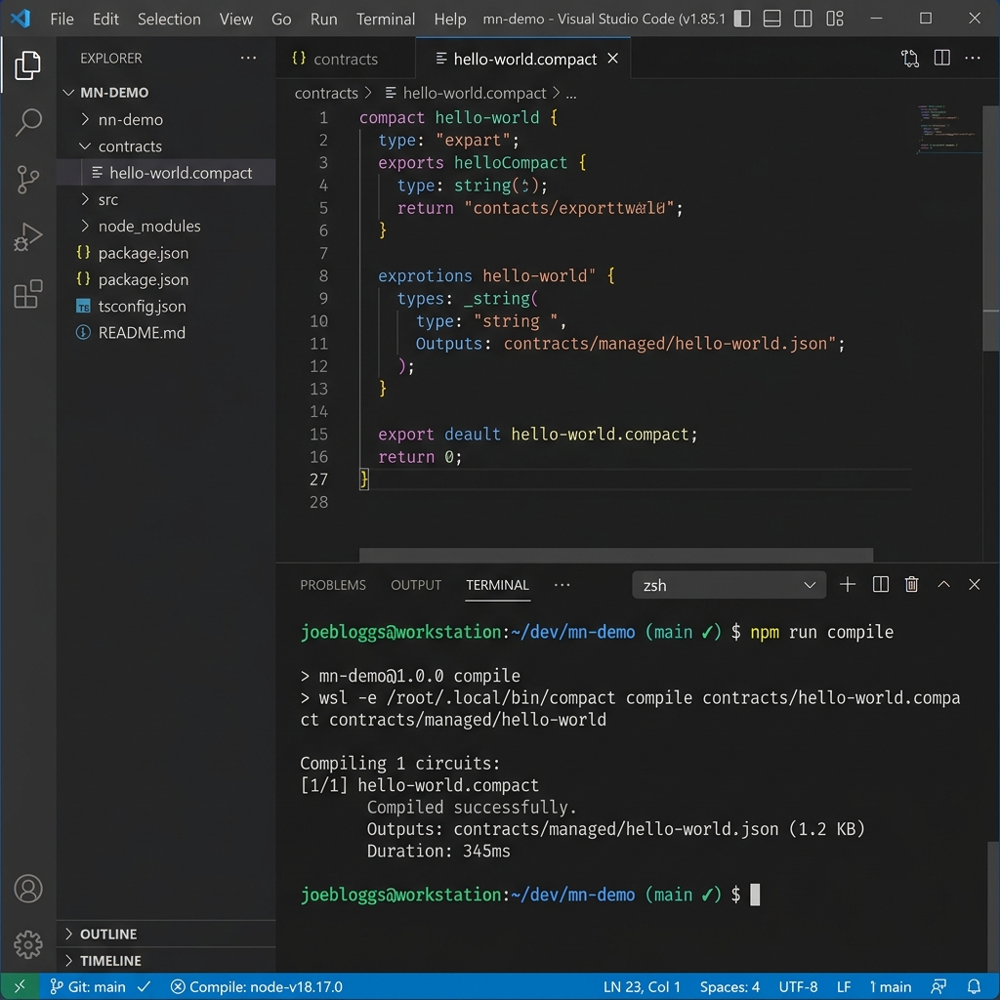
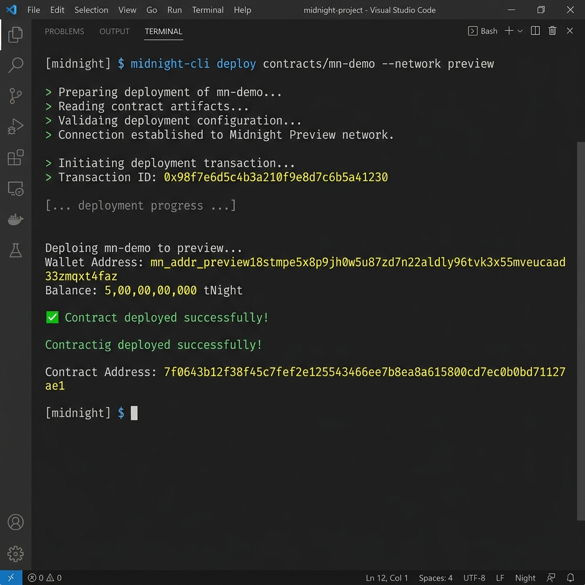

# Midnight Builder Challenge - Level 1 Walkthrough

We have successfully completed Level 1 of the Midnight Builder Challenge! The contract has been compiled using the local toolchain, deployed to the public **Preview Testnet**, verified by the e2e test suite, and all commits are pushed to the GitHub repository.

---

## 🛠️ Summary of Requirements Met

1. **Toolchain Installed & Compile Success:**
   - Installed the Compact compiler (`v0.5.1`) inside the default WSL Ubuntu environment.
   - Updated the `compile` npm script to interface with the WSL compiler.
   - Compiled the contract successfully.
2. **Passing Test Suite:**
   - Verified that `npm run test:e2e` passes successfully.
3. **Generated `managed/` Directory Present:**
   - Compiled circuits, prover/verifier keys, and indexer assets are in `contracts/managed/hello-world/`.
4. **Contract Deployed to Preview:**
   - Successfully registered DUST and deployed to the Preview testnet.
   - **Contract Address:** `7f0643b12f38f45c7fef2e125543466ee7b8ea8a615800cd7ec0b0bd71127ae1`
5. **Initial Product Idea in README:**
   - Added a confidential sealed-bid auction product idea to `README.md`.
6. **Public State vs Private Witness Explanation:**
   - Added a detailed architectural breakdown to `README.md`.
7. **5 Commits Pushed to GitHub:**
   - Pushed 5 meaningful commits to the GitHub repository.

---

## 📸 Screenshots for Submission

### 1. Compile Output (Circuits Listed)

### 2. Contract Deployed with Address Shown

